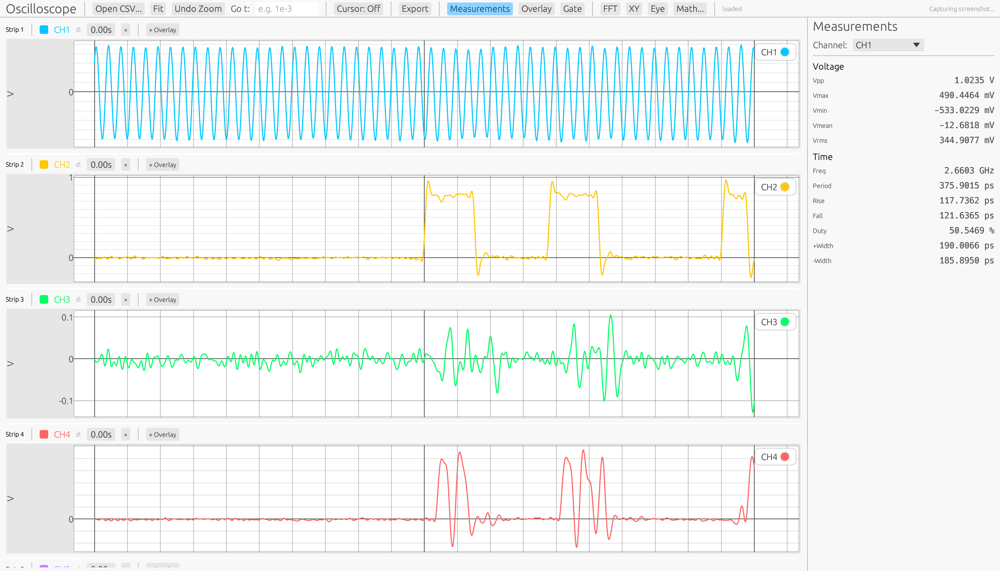

# Oscilloscope Waveform Viewer

基于 [egui](https://github.com/emilk/egui) + [Polars](https://pola.rs/) 的高性能示波器波形查看与分析工具。支持多通道 CSV 数据加载、自动测量、FFT 频谱分析、XY 模式、数学通道和眼图（Eye Diagram）绘制。

## 功能特性

### 波形显示

- **多通道分栏显示** — 每个通道独立分栏，可拖拽合并到同一栏内叠加显示
- **联动 X 轴** — 所有分栏共享时间轴，同步缩放和平移
- **通道管理** — 双击重命名、独立延迟调节、拖拽排序、移除/拆分
- **智能降采样** — 基于可见范围的 Min/Max 降采样（M4 算法），即使千万级数据点也能流畅交互

### 导航

- **滚轮缩放** — X 轴方向缩放波形
- **拖拽平移** — 拖动波形左右平移
- **Fit 按钮** — 一键适配全部数据到视图
- **撤销缩放** — 最多回退 50 级缩放历史
- **跳转到时间** — 输入时间值（支持科学计数法如 `1e-6`），自动居中

### 光标

| 模式 | 测量内容 |
|------|---------|
| 关闭 | 无光标 |
| 垂直 (Delta-T) | Delta-T、1/Delta-T、T-A、T-B |
| 水平 (Delta-V) | Delta-V、V-A、V-B |

光标可拖拽移动，支持 **测量门控** — 开启后测量值限定在光标 A-B 范围内。

### 自动测量

| 测量项 | 说明 |
|--------|------|
| Vpp | 峰峰值电压 |
| Vmax / Vmin | 最大 / 最小电压 |
| Vmean | 平均电压 |
| Vrms | 有效值电压 |
| Freq / Period | 频率 / 周期（中值电平过零检测） |
| Rise / Fall | 上升时间 / 下降时间（10%→90%） |
| Duty | 占空比 |
| +Width / -Width | 正 / 负脉宽 |

- 电压统计通过 Parquet 聚合直接计算，速度极快
- 时间域测量从原始采样点提取，SI 前缀自动格式化
- 测量面板和波形叠加显示可独立开关

### FFT 频谱分析

- 支持通道选择、窗函数（Rectangle / Hanning / Blackman-Harris）、线性/dB 刻度
- 最多 131,072 个采样点，自动补零到 2 的幂次
- 独立浮动窗口，支持缩放和拖拽

### XY 模式 (Lissajous)

- 任意两个通道的参数曲线显示
- 独立窗口，支持双轴缩放
- 适用于相位关系分析和信号对齐

### 数学通道

| 运算 | 公式 | 类型 |
|------|------|------|
| Add | A + B | 二元 |
| Subtract | A - B | 二元 |
| Multiply | A × B | 二元 |
| Invert | -A | 一元 |
| Abs | \|A\| | 一元 |
| Derivative | dA/dt | 一元 |
| Integral | ∫A dt | 一元 |

数学通道创建后可作为普通通道使用，支持叠加显示和测量。

### 眼图 (Eye Diagram)

- **自动 UI 检测** — 基于 Schmitt 触发边沿检测 + 间隙聚类的 UI 周期自动识别
- **外部时钟** — 支持指定外部时钟通道，可选上升/下降/双边沿触发
- **DDA 连线光栅化** — 相邻采样点之间完整连线，形成连续轨迹（非离散点）
- **对数压缩** — Log 归一化处理大动态范围密度数据
- **8 种颜色模式** — Monochrome、Rainbow、Temperature、Grayscale、Phosphor（默认）、Viridis、Ironbow、CRT Amber
- 可调参数：UI 周期、UI 数量（2-8）、饱和度
- 自动在当前可见时间范围上绘制

### 数据导入/导出

- **CSV 加载** — 后台线程解析，实时进度条显示
- **Parquet 缓存** — 首次加载自动转换为 Parquet，后续打开秒级加载
- **导出 CSV** — 保存可见范围数据
- **导出 PNG** — 截图当前波形视图

## 数据格式要求

输入文件为 CSV（逗号分隔），纯数值，无表头：

```
-1.32094967E-06, -3.608419E-02, -7.65844E-03, 2.50038E-03, ...
-1.32093405E-06, 9.484693E-02, -6.89313E-03, 2.88304E-03, ...
```

| 要求 | 说明 |
|------|------|
| 列 0 | 时间轴（秒），必须单调递增 |
| 列 1+ | 电压数据通道（伏特），每列一个通道 |
| 分隔符 | 逗号 `,` |
| 数值格式 | 标准浮点数或科学计数法（`E` 或 `e`） |
| 表头 | 不需要，所有行均为数据 |
| 编码 | UTF-8 或 ASCII |

支持空格前缀（如 ` -3.6E-02`），自动去除空白字符。

## 安装与运行

### 从 Release 下载

前往 [Releases 页面](https://github.com/weiwangfds/vamame/releases) 下载 Windows 二进制：

```
oscilloscope-vX.Y.Z-windows-x86_64.exe
```

双击运行即可。

### 从源码构建

需要 Rust 工具链（[安装指南](https://rustup.rs/)）：

```bash
# 克隆仓库
git clone https://github.com/weiwangfds/vamame.git
cd vamame

# 构建 release 版本
cargo build --manifest-path oscilloscope/Cargo.toml --release

# 运行
./oscilloscope/target/release/oscilloscope
```

### 命令行参数

```bash
# 启动后直接加载文件
oscilloscope /path/to/data.csv
```

### 交互操作

| 操作 | 方式 |
|------|------|
| 缩放 | 鼠标滚轮 |
| 平移 | 左键拖拽波形区域 |
| 光标拖拽 | 左键拖拽光标线附近 |
| 通道合并 | 拖拽通道色块到目标分栏 |
| 通道重命名 | 双击通道名 |
| 分栏调整 | 拖拽分栏之间的分割线 |

## 截图



## 技术架构

| 组件 | 技术 |
|------|------|
| GUI 框架 | egui / eframe 0.31 |
| 绘图 | egui_plot |
| 数据引擎 | Polars（LazyFrame + Parquet 后端） |
| 降采样 | M4 Min/Max 算法 |
| FFT | rustfft |
| 文件对话框 | rfd |

## License

MIT
